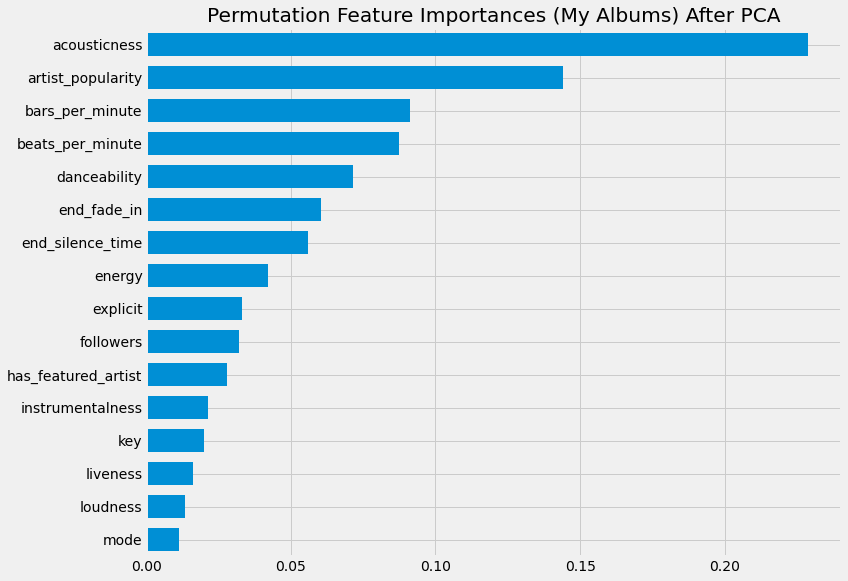
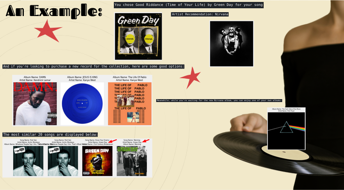
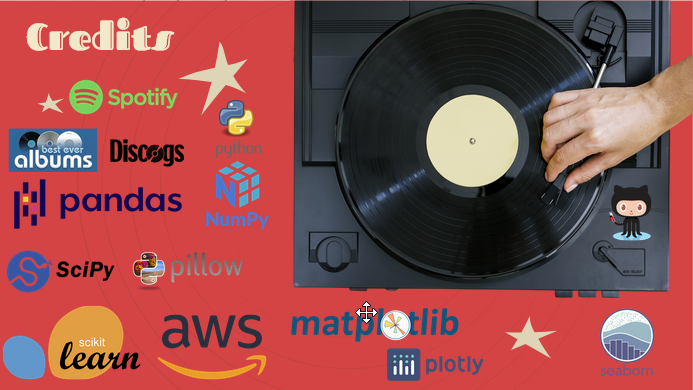

# And Vinyl-ly

## Overview

### The Problem

Time is precious & too often we spend too much time in the presence of company making small insignificant decisions like where do we go eat, or in this case, what music do we listen to?

### The Solution

Since it's much easier to identify a song that is stuck in your head rather than an entire album, I made a song recommendation system using Python and the Spotipy API in which you can input the single song that is stuck in your head. The recommender will then output multiple songs, albums and an artist that are similar to that song that has been inputted. As a bonus, since we like to play vinyl records in our home I've also added a feature to recommend from the alubms that I currently own.

## Getting the Data

1) Using [Best Ever Albums](https://www.besteveralbums.com/index.php) service I was able to pull the top 1,000 albums from both the 2000s and 2010s. Also in order to get some older albums in there I pulled The Rolling Stones to 100 albums as well.
2) Next created a pipeline that works with the [Spotipy API](https://spotipy.readthedocs.io/en/2.18.0/) to pull song data from all of these albums
3) Then updated and revised this pipeline many times over in order to get the correct information in the proper places. Including using Multi-Indexing in Pandas so that I can keep the text data while still holding all of the numerical values in the same DataFrame
4) Setup an AWS EC2 instance in order to be able to pull the information from the API on one computer and continue working on another (otherwise API script would be crashing kernels)

## Visualizing Data

* In order to help visualize how the data looks I made a few 3D plots using [Plotly](https://plotly.com/) for both the full dataset and my own
  * This of course only uses a few dimensions but you can also see another Unsupervised learning technique in [Kmeans Clustering](https://scikit-learn.org/stable/modules/generated/sklearn.cluster.KMeans.html?highlight=kmeans#sklearn.cluster.KMeans) that shows as colors in the plots below:

[Just My Albums](https://plotly.com/~ltonstad/1/)

[All Albums in Data](https://plotly.com/~ltonstad/5/)

## How does the recommender work?

1) First we fit the data to the recommender (both the entire dataset and the information from my own vinyl collection)
2) The Recommender then scales all of the data using the [Standard Scaler from SKLearn](https://scikit-learn.org/stable/modules/generated/sklearn.preprocessing.StandardScaler.html) and creates a similarity matrix based on the [Cosine Similarity](https://scikit-learn.org/stable/modules/generated/sklearn.metrics.pairwise.cosine_similarity.html) metric
3) At this point the user then inputs the name of a song and the artist that performs the song. A script runs that pulls the relevant data from the Spotipy API and compares where it falls in line within that similarity matrix
4) The recommender then outputs songs (amount chosen by user, or defaults to 12), a recommended artist, albums that could be good to listen too (this is calculated by grouping all songs in an album together and aggregating by the mean of each feature) **And Vinyl-ly** it recommends a vinyl record to play that is already in possession that can be played right now!

## Reducing Dimensionality with PCA

* Dimensionality reduction was done both on my own dataset as well as the full dataset using [PCA](https://scikit-learn.org/stable/modules/generated/sklearn.decomposition.PCA.html?highlight=pca#sklearn.decomposition.PCA), which ultimately reduced from 27 different features down to 19 in the full dataset and 16 in my personal collections dataset
  * The Recommender is setup to account for both of these changes by fitting the 27 columns that is ran in that script to fit both the full and personal datasets features

## An Example

## Conclusions

* Currently the system does well at some things, not so well at others:
  * The Bad:
  
    > * Recommending new albums from the full dataset (Seems to still somehow be overfitting to popular artists & has no account for genre)
    > * Recommended songs can have repeats and often has many recommended from same artist
  * The Good:
  
    > * Recommended songs do actually make sense, just need to go back and revise to account for whats covered above
    > * Artist recommendations have generally made sense to me in practice
    > * Recommending vinyls from my own collection is consistently good

## For Future

* Want to move system into a production environment (Flask, Dash)
* Work on recommender class more
* Clean up code and add more re-producability

## Credits

* https://www.besteveralbums.com/index.php
* https://towardsdatascience.com/how-to-build-an-amazing-music-recommendation-system-4cce2719a572
* https://slidesgo.com/theme/retrokey-branding-guidelines#search-Music&position-3&results-18
